# DORA Architecture

**Version:** 1.0  
**Date:** 2026-08-17  
**Phase:** 1 - Establish DORA Architecture  
**Status:** Proposed MVP architecture

## 1. Purpose

DORA is an AI-powered commodity intelligence and management decision-support platform. This architecture turns heterogeneous price, news, risk, market, and manufacturing data into traceable signals, forecasts, scenarios, management insights, alerts, and reports.

The MVP optimises for rapid delivery, credible real data, low idle Azure cost, and a polished decision experience. It uses modular intelligence services on a shared ingestion and reasoning platform. It does not create five autonomous LLM agents. Each service boundary is nevertheless stable enough to become a dedicated Microsoft Foundry agent later without changing callers or the core data contracts.

This document refines the baseline in [Current-State Assessment](current-state-assessment.md). No Azure resource is assumed reusable until the target subscription and ownership are confirmed.

## 2. Architecture Principles

1. **Evidence before explanation.** Every insight must identify the observations, documents, transformations, and timestamps that support it.
2. **Code calculates; AI interprets.** Deterministic services calculate prices, changes, trends, risk scores, forecasts, and scenarios. The model explains and synthesises those results.
3. **One platform, five modules.** Intelligence domains share connectors, storage, retrieval, reasoning, security, and telemetry.
4. **Modular monolith first.** Logical boundaries are enforced in code, but MVP deployment units remain few and inexpensive.
5. **Ports before products.** Storage, model, retrieval, notification, and source-provider interfaces prevent Azure service choices from leaking into domain logic.
6. **Immutable raw data.** Source payloads are retained with checksums and licence metadata before transformation.
7. **Freshness is explicit.** "Live" means refreshed to the source's documented cadence, never an unsupported claim of exchange-level real-time data.
8. **Managed identity by default.** Applications do not hold Azure service credentials.
9. **Asynchronous where useful, not everywhere.** The scheduled pipeline handles ingestion and precomputation; interactive reads and lightweight scenarios remain synchronous.
10. **Evolution is triggered by evidence.** Services, agents, queues, search, and premium infrastructure are added only for measured scale, quality, or governance needs.

## 3. Required Logical Pipeline

DORA implements the requested processing chain as explicit stages:

```mermaid
flowchart LR
    Sources[External / Internal Sources]
    Connectors[Source Connectors]
    Raw[Raw Ingestion]
    Normalise[Normalisation]
    Enrich[Signal Enrichment]
    Intelligence[Commodity Intelligence Engine]
    Forecast[Forecast / Scenario Engine]
    Reason[DORA AI Reasoning Layer]
    Repository[Insight Repository]
    Dashboard[Management Dashboard]
    Outputs[Alerts / Reports / Email]

    Sources --> Connectors --> Raw --> Normalise --> Enrich --> Intelligence
    Intelligence --> Forecast --> Reason --> Repository --> Dashboard --> Outputs
    Intelligence --> Reason
    Forecast --> Repository
```

The arrows describe dependency and data progression, not mandatory network boundaries. In the MVP, most stages execute within the scheduled pipeline job or the web/BFF application and communicate through typed application interfaces and persisted records.

## 4. Intelligence Domains

### 4.1 Shared service contract

All five domains implement the same conceptual contract:

```text
analyse(IntelligenceRequest) -> IntelligenceResult

IntelligenceRequest
- domain
- commodityIds[]
- geographyIds[]
- asOf
- horizon
- scenarioId?
- userContext

IntelligenceResult
- domain
- generatedAt
- freshness
- signals[]
- metrics[]
- evidenceRefs[]
- confidence
- limitations[]
- suggestedActions[]
```

The contract is model-independent. An MVP implementation is an in-process module. A future implementation may call a Foundry agent behind the same interface.

### 4.2 Domain responsibilities

| Intelligence service | MVP responsibility | Inputs | Principal outputs | Future agent opportunity |
|---|---|---|---|---|
| Live Commodity Price | Normalise benchmarks, calculate changes, volatility, trend, spreads, anomalies, and freshness | Price observations, FX, units, calendars | Price signals, anomalies, trend summaries | Agent only if conversational investigation requires independent market-data tools |
| Live News & Updates | Ingest permitted feeds, classify relevance, extract entities/events, deduplicate, and link stories to commodities | Licensed/public news and releases | Event clusters, novelty, relevance, source summaries | Agent if it needs autonomous multi-source research under separate policies |
| Emerging Risk | Combine thresholds, anomalies, supply events, geopolitical/weather inputs, and exposure | Signals, events, forecasts, manufacturing dependencies | Risk score, severity, likelihood, time horizon, evidence | Agent if risk workflows need dedicated tools, approvals, or domain evaluations |
| Market Intelligence | Synthesize supply, demand, inventory, macro drivers, market structure, and scenarios | Price, macro, news, risk, forecast data | Market regime, drivers, opportunities, decision brief | Strong candidate for a specialised agent after retrieval quality is proven |
| Manufacturing Status | Track site, line, inventory, supplier, order, downtime, and material exposure | Internal ERP/MES/manual feeds plus commodity signals | Constraint status, material exposure, production-impact signals | Agent only after secure internal tool access and action boundaries are defined |

### 4.3 Module boundaries

Each module owns its rules, feature definitions, evaluation cases, and presentation adapter. Modules may consume shared canonical data and published signals but must not read another module's private tables or invoke the language model directly. All model calls pass through the DORA AI Reasoning Layer.

## 5. Application Architecture

The MVP uses a monorepo and two deployable workloads:

- **DORA Web/BFF:** Next.js and TypeScript, containing the dashboard, server-side API routes, application services, intelligence interfaces, interactive scenarios, report rendering, and reasoning gateway.
- **DORA Pipeline Job:** A scheduled Node.js/TypeScript Container Apps Job containing connector execution, raw persistence, normalisation, enrichment, batch intelligence, forecasts, alert evaluation, and scheduled brief generation.

Shared packages provide canonical contracts, domain types, validation schemas, analytics functions, provider ports, and telemetry conventions. This preserves one language and one dependency/tooling path for the first vertical slice.

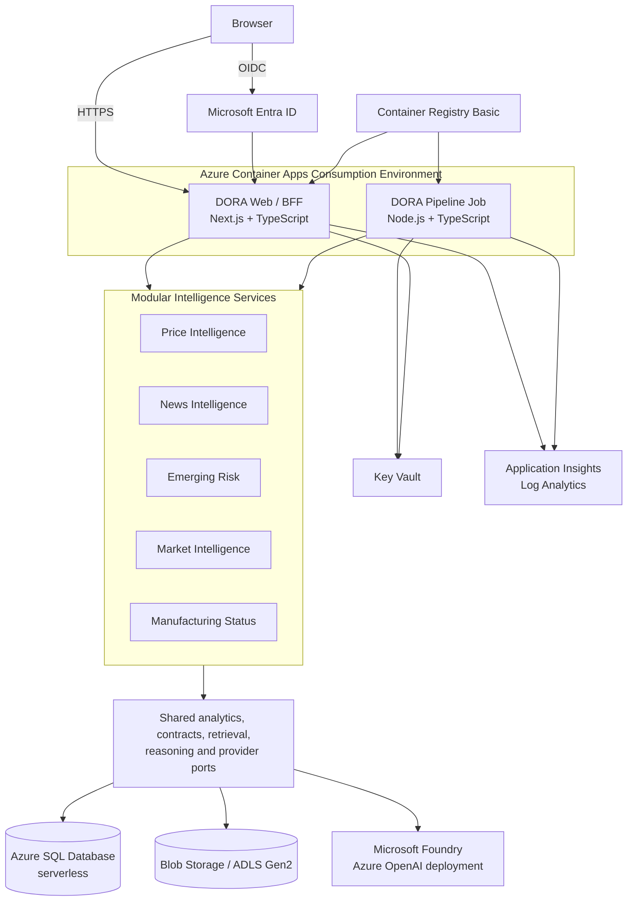

### MVP runtime boundaries

| Boundary | Allowed | Prohibited |
|---|---|---|
| Browser | Presentation, local interaction state, chart rendering | Azure credentials, direct database/model access, authoritative calculations |
| Web/BFF | Authorisation, queries, interactive scenarios, reasoning requests, reports | Unbounded ingestion, arbitrary model tools, source secrets in responses |
| Pipeline Job | Source access, transformation, batch intelligence, scheduled outputs | User-facing session state, direct email without notification policy |
| Intelligence modules | Deterministic domain rules and evidence selection | Direct vendor SDKs, direct model calls, cross-module private storage |
| Reasoning layer | Retrieval orchestration, prompt policy, model calls, validation | Authoritative KPI calculation, unrestricted data access, unsupported claims |
| Provider adapters | Azure/vendor SDK integration | Business rules |

## 6. Data Flow

```mermaid
flowchart LR
    Provider[Provider payload]
    RawObject[Immutable raw object\nchecksum + licence + timestamps]
    Canonical[Canonical records\nvalidated units and identifiers]
    Features[Enriched features\nand event links]
    Signals[Versioned signals]
    Forecasts[Forecasts and scenarios]
    Evidence[Evidence bundle]
    Insight[Validated insight\nwith citations]
    ReadModel[Dashboard read models]
    User[Decision maker]

    Provider --> RawObject
    RawObject -->|parse + validate| Canonical
    Canonical -->|deterministic enrichment| Features
    Features --> Signals
    Signals --> Forecasts
    Signals --> Evidence
    Forecasts --> Evidence
    Evidence --> Insight
    Insight --> ReadModel
    Forecasts --> ReadModel
    Signals --> ReadModel
    ReadModel --> User
    User -->|scenario assumptions| Forecasts
```

### Data quality gates

A record advances only when its schema, source identity, observation time, unit, currency, geography, and licence fields are valid. Failures are quarantined rather than silently discarded. Every transformation records a code/schema version and parent references.

### Freshness model

Each series and insight carries:

- `sourceObservedAt`: time represented by the source.
- `sourcePublishedAt`: source publication time when available.
- `retrievedAt`: DORA retrieval time.
- `processedAt`: successful canonicalisation time.
- `expectedCadence`: source-specific target cadence.
- `freshnessStatus`: `fresh`, `delayed`, `stale`, or `unknown`.
- `freshnessReason`: machine-readable cause and user-facing explanation.

Dashboard labels use these fields. "Live" is never inferred solely from the current clock.

## 7. Ingestion Flow

Each connector implements `discover`, `fetch`, `checkpoint`, and `health` operations behind a common source port. Connectors are configuration-driven for cadence, retries, rate limits, and data-use constraints.

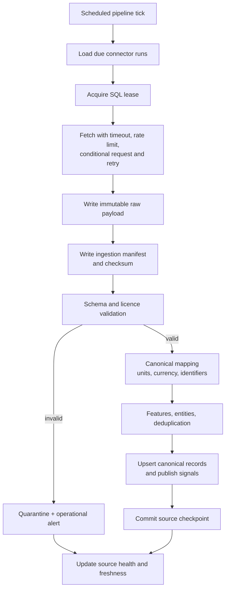

### Idempotency and retries

- A run key combines connector, source partition, source version/checkpoint, and scheduled window.
- Raw object names include source, retrieval date, run ID, and checksum.
- SQL writes use natural source keys plus revision/version fields.
- Checkpoints advance only after canonical writes succeed.
- Exponential retry applies only to transient failures; authentication, schema, licence, and validation failures require intervention.
- SQL leases prevent overlapping 15-minute dispatcher runs from processing the same work.
- Dead-letter state is represented in the ingestion-run table for MVP; Service Bus becomes the production dead-letter mechanism.

## 8. Scheduling

One Container Apps Job runs every 15 minutes. A lightweight scheduler reads connector and task definitions from Azure SQL, claims due work, and executes within configured concurrency. This supports different source cadences without creating one Azure resource per connector.

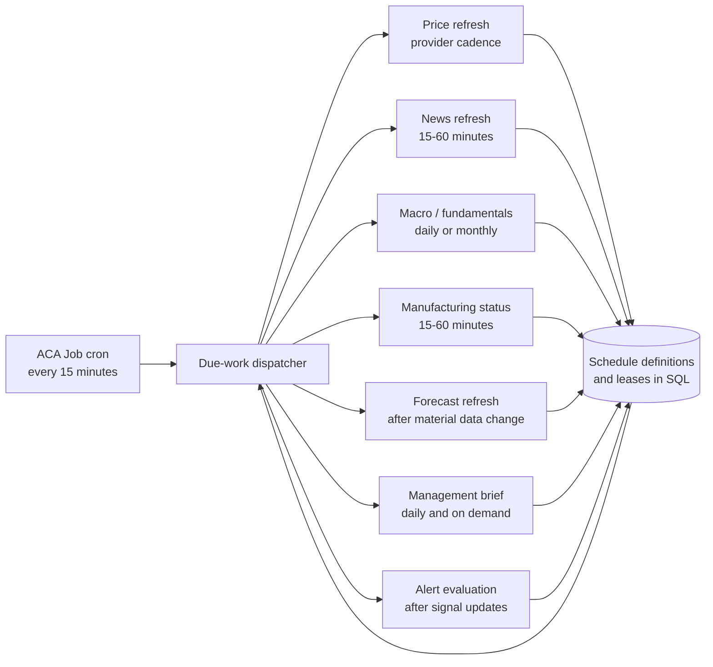

### Scheduling rules

- Provider cadence and licence limits override a generic "live" interval.
- Tasks use a maximum runtime and heartbeat; abandoned leases become retryable after expiry.
- Forecasts and briefs use change detection to avoid unnecessary recomputation and model cost.
- On-demand refresh is admin-only, rate-limited, audited, and still passes through connector policies.
- Production may split high-volume tasks into event-driven workers while preserving the same task contract.

## 9. Storage Architecture

DORA separates source truth, operational truth, retrieval material, and presentation projections.

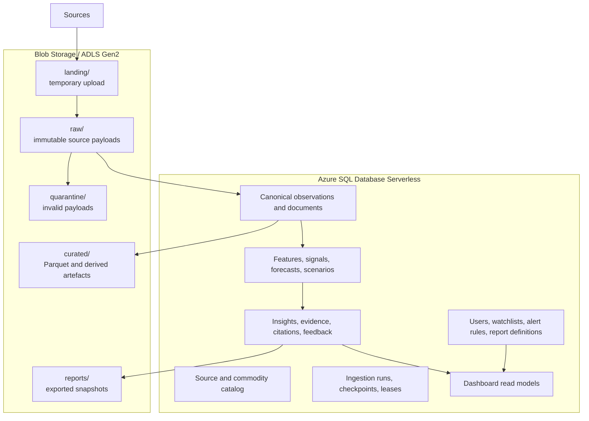

### Core data entities

| Area | Entities |
|---|---|
| Catalog | `source`, `source_dataset`, `commodity`, `instrument`, `geography`, `unit`, `currency`, `manufacturing_site` |
| Operations | `ingestion_run`, `ingestion_item`, `checkpoint`, `schedule`, `lease`, `data_quality_issue` |
| Canonical | `price_observation`, `fundamental_observation`, `document`, `document_entity`, `manufacturing_observation` |
| Intelligence | `feature`, `signal`, `risk_assessment`, `forecast_run`, `forecast_point`, `scenario`, `scenario_result` |
| Insight | `evidence`, `insight`, `citation`, `prompt_version`, `model_invocation`, `user_feedback` |
| Product | `watchlist`, `alert_rule`, `alert_event`, `notification`, `report_definition`, `report_run` |

### Retention

- Raw snapshots remain immutable for the policy-defined audit window.
- Curated artefacts can be regenerated and use lifecycle tiers.
- SQL operational logs are retained only as long as needed for support and audit.
- Model prompts/responses are not automatically treated as durable source records; validated insights and safe metadata are retained according to policy.

## 10. Signal, Intelligence, Forecast, and Scenario Processing

### Signal enrichment

Enrichment is deterministic and versioned. Examples include returns, rolling volatility, moving averages, percentile bands, anomaly scores, sentiment labels, event novelty, supply-demand deltas, inventory coverage, manufacturing material exposure, and source confidence.

### Commodity Intelligence Engine

The engine coordinates the five intelligence modules and creates a shared `EvidenceBundle`. It resolves conflicts by preserving source-specific values and expressing confidence/limitations rather than collapsing uncertain data into a single unsupported fact.

### Forecast and scenario engine

- Forecasts are generated by explicit statistical or machine-learning models with backtesting metadata.
- Baselines should begin with naive, seasonal, moving-average, or regression models before complex approaches.
- Each forecast stores training window, feature version, algorithm/version, confidence interval, evaluation metrics, and run time.
- Scenarios are conditional calculations from user assumptions; they are not presented as probabilities unless a calibrated probability model exists.
- The LLM may explain model outputs but cannot alter forecast points or scenario calculations.

## 11. DORA AI Reasoning Flow

The DORA AI Reasoning Layer is a shared orchestration service, not a collection of autonomous agents. It provides one controlled path to the model for all domains.

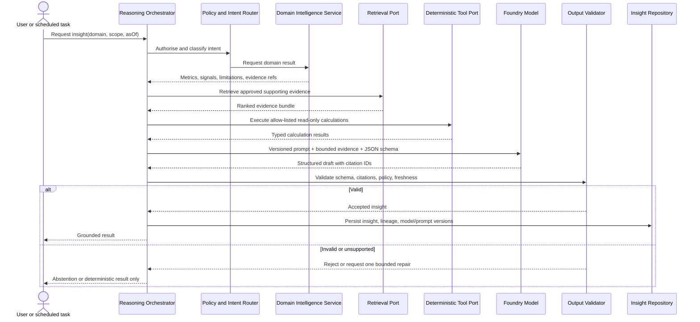

### Reasoning controls

- The model receives bounded evidence selected by code, not unrestricted database or internet access.
- Tools are allow-listed, typed, read-only, time-limited, and authorised for the current user/domain.
- Prompts request structured JSON validated against a versioned schema.
- Citation IDs must resolve to evidence visible to the requesting user.
- Unsupported claims trigger rejection, one bounded repair attempt, or abstention.
- Temperature is low for management briefs; model and prompt versions are recorded.
- Input documents are untrusted data. Their instructions are never promoted to system/tool instructions.
- Personally identifiable, confidential, or licensed content is minimised in prompts and telemetry.

## 12. RAG and Search Architecture

The retrieval contract is implemented from the start even though Azure AI Search is deferred from the lean MVP.

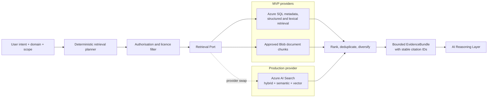

### Retrieval requirements

- Enforce user access, source licence, geography, time range, freshness, and domain before ranking.
- Prefer structured observations for numeric claims and source documents for narrative claims.
- Chunk documents by semantic structure while preserving source, publication time, section, and licence metadata.
- Use stable citation IDs independent of search provider.
- Keep retrieval evaluation datasets with expected sources, relevance judgements, and unsupported-answer cases.
- Add Azure AI Search when document volume, latency, multilingual retrieval, or hybrid/vector quality makes SQL retrieval insufficient.

## 13. Insight Repository

The Insight Repository is the durable boundary between computation/reasoning and user experiences. It stores:

- Domain, commodity, geography, as-of time, and validity window.
- Structured headline, summary, drivers, risks, opportunities, and suggested actions.
- Supporting metrics, signals, forecasts, scenarios, and evidence references.
- Citation mapping, freshness, confidence, limitations, and abstention reason.
- Generator type, model deployment, model version, prompt version, tool versions, and token usage.
- Review state, supersession link, user feedback, and audit metadata.

An insight is immutable after publication. Corrections or refreshed analysis create a new version and supersede the prior record.

## 14. Management Dashboard

The dashboard is a decision cockpit rather than a collection of generic cards:

- **Overview:** portfolio-level movements, top risks, manufacturing exposure, freshness, and priority actions.
- **Commodity detail:** benchmark history, drivers, related events, risk state, forecast bands, and evidence.
- **News and updates:** deduplicated event clusters linked to commodities, sites, suppliers, and risks.
- **Risk radar:** severity, likelihood, horizon, exposure, trend, owner, and mitigation status.
- **Scenario workspace:** direct manipulation of assumptions with immediate deterministic results and an optional AI explanation.
- **Manufacturing status:** material availability, site/line constraints, inventory coverage, supplier events, and commodity sensitivity.
- **Briefs and reports:** validated insight versions, citations, review state, and exports.
- **Data health:** source freshness, failures, quarantine, quality, and licence status for administrators.

All views display units, source, as-of time, freshness, and confidence near the value they qualify. WCAG 2.2 AA, keyboard operation, reduced motion, responsive layout, and print quality are acceptance criteria.

## 15. Reporting and Notification Flow

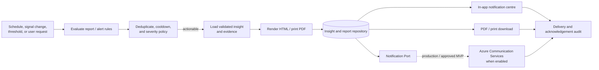

### MVP reporting scope

- In-app alerts and browser/print-quality reports are required.
- Email is implemented behind a notification port and enabled only when an approved provider exists.
- Alert rules use deterministic signals; AI may explain an alert but cannot decide whether a threshold was crossed.
- Deduplication, cooldown, acknowledgement, expiry, and escalation state prevent alert fatigue.
- Reports snapshot the exact insight/evidence versions used so later data revisions do not rewrite history.

## 16. Security Architecture

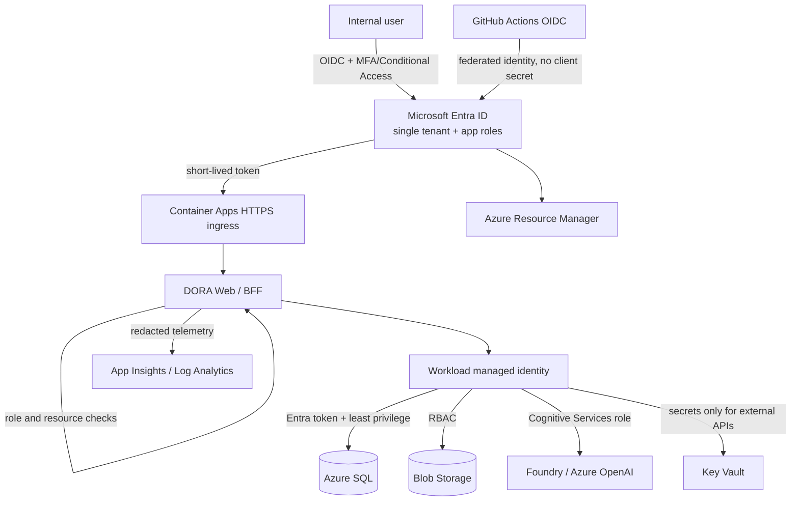

### Security controls

- Entra app roles: `Viewer`, `Analyst`, `Operations`, and `Administrator`; permissions are enforced server-side.
- Managed identities receive resource-specific data-plane roles. No storage keys, database passwords, or model API keys are used where identity is supported.
- Key Vault stores only third-party API credentials, certificates, or unavoidable secrets.
- Source documents and manufacturing data carry classification and access metadata enforced before retrieval.
- HTTPS-only ingress, secure headers, anti-CSRF controls, input validation, rate limits, and dependency scanning are baseline controls.
- User inputs and retrieved content are treated as untrusted; tool permissions are not derived from prompt text.
- Logs exclude access tokens, secrets, full licensed documents, and raw model prompts by default.
- Private endpoints, WAF, and dedicated network isolation are production hardening options after the target environment and policy are known.

## 17. Observability Architecture

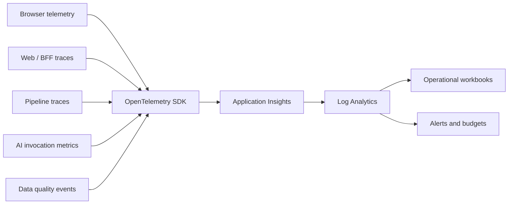

### Correlation and telemetry

Use W3C trace context and these stable identifiers where applicable:

- `request_id`, `trace_id`, and `user_tenant_id` (never raw user tokens).
- `ingestion_run_id`, `source_id`, `dataset_id`, and `raw_object_id`.
- `signal_id`, `forecast_run_id`, `scenario_id`, and `insight_id`.
- `model_invocation_id`, `model_deployment`, `prompt_version`, and `retrieval_run_id`.

### Key measures

| Concern | Measures |
|---|---|
| Availability | Request success, latency, Container App replicas/restarts, SQL dependency health |
| Data | Source freshness, run duration, records accepted/rejected, quarantine count, checkpoint lag |
| Intelligence | Signals produced, forecast error, scenario latency, stale insight count |
| AI | Invocation latency, token use, cost estimate, schema-valid rate, citation-valid rate, abstention rate |
| Retrieval | Recall/precision evaluation, no-result rate, evidence age, ACL-filtered count |
| Product | Dashboard latency, report generation, alert acknowledgement, feedback rating |
| Cost | Container execution, SQL compute, storage growth, log ingestion, model tokens by feature |

Sampling and daily caps control cost. Security-sensitive or licensed content is represented by identifiers and classifications rather than copied into telemetry.

## 18. Reliability and Failure Behaviour

- The dashboard remains available with the latest validated data when sources or the model are unavailable.
- Stale data is visibly labelled; it is not silently treated as current.
- The pipeline can replay from immutable raw data without re-fetching a provider.
- A failed domain module does not block successful independent modules from publishing.
- AI failure falls back to deterministic metrics and previously validated insights, clearly timestamped.
- Report and notification retries are idempotent and do not duplicate deliveries.
- Database migrations, prompt versions, feature versions, and source schemas are backwards-compatible during rolling deployment.

## 19. Production Evolution

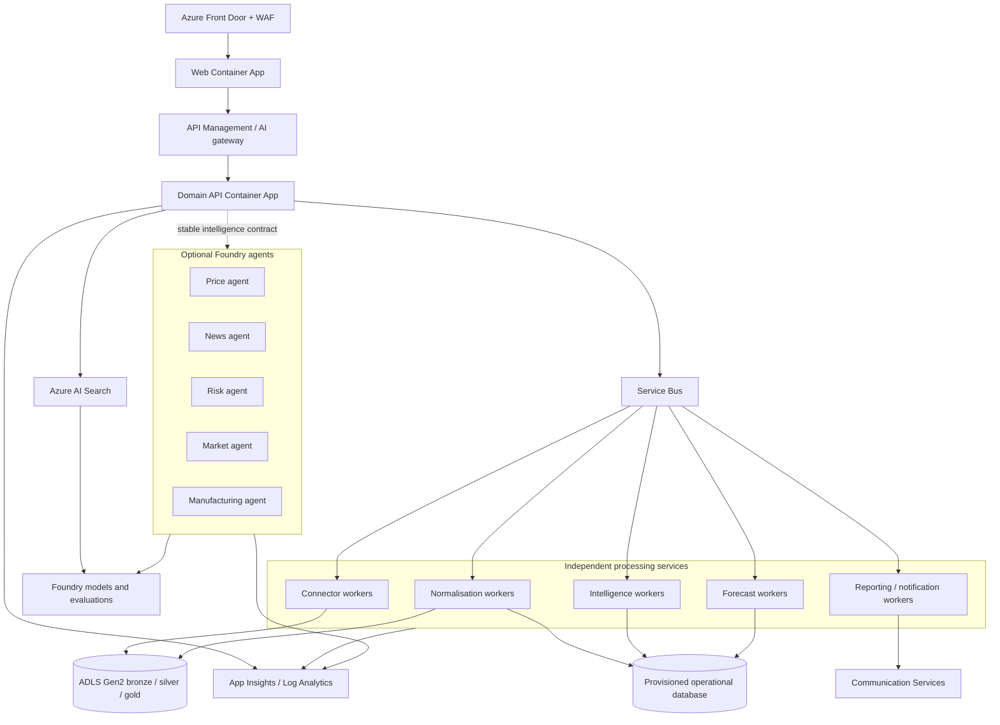

### Evolution stages

| Stage | Trigger | Change |
|---|---|---|
| MVP | Tens of users, few sources, moderate cadence | Two workloads, SQL scheduler, SQL/Blob retrieval, one shared reasoning layer |
| Scale ingestion | Overlapping runs, sustained backlog, provider fan-out | Add Service Bus and independently scaled connector/normalisation workers |
| Scale retrieval | Document corpus or retrieval quality exceeds SQL approach | Add Azure AI Search behind the existing retrieval port |
| Scale application | Independent release/scale requirements | Split web, API, reasoning, forecast, and reporting Container Apps |
| Govern APIs/AI | External consumers, quotas, semantic caching, chargeback | Add API Management and model gateway policies |
| Specialise intelligence | A domain needs unique tools, memory, model, policy, evaluation, or ownership | Replace that module adapter with a dedicated Foundry agent |
| Harden production | Defined SLO/RTO/RPO and sensitive data | Front Door/WAF, private networking, provisioned capacity, DR, multi-region where justified |

### Agent extraction criteria

A domain becomes a dedicated Foundry agent only when at least one of these is demonstrated:

- It needs an independent tool set or data-access policy.
- It requires a different model, prompt lifecycle, safety policy, or evaluation suite.
- It has long-running multi-step reasoning that cannot be expressed as deterministic orchestration.
- It requires independent deployment, scaling, budget, ownership, or audit boundaries.
- Offline evaluations show a specialised agent materially improves decision quality.

Agent extraction does not transfer authoritative calculations to the model. Dedicated agents continue to consume the same typed intelligence, retrieval, and evidence contracts.

## 20. MVP Deployment Inventory

Subject to subscription approval, the initial environment contains:

| Resource | Quantity | MVP configuration |
|---|---:|---|
| Resource group | 1 | DORA-specific tags and budget |
| Container Apps environment | 1 | Consumption |
| Web/BFF Container App | 1 | Min replicas 0 outside planned demos |
| Scheduled Container Apps Job | 1 | 15-minute cron dispatcher |
| Container Registry | 1 | Basic |
| Storage account | 1 | StorageV2, hierarchical namespace, lifecycle policy |
| Azure SQL logical server/database | 1/1 | Serverless, auto-pause, conservative max vCores |
| Key Vault | 1 | RBAC mode, purge protection policy per environment |
| Foundry project/account and model deployment | 1 | Small capable model; quota and region to be confirmed |
| Application Insights | 1 | Workspace-based |
| Log Analytics workspace | 1 | Short retention, sampling, daily cap |
| Azure AI Search | 0 initially | Add behind retrieval port when triggered |
| API Management | 0 initially | Add when governance/external API trigger is met |
| Communication Services | 0 initially | Add when approved email/SMS delivery is required |

## 21. Architecture Fitness Checks

The implementation should continuously prove these properties:

- Every published insight resolves all citation IDs to authorised evidence.
- Re-running an ingestion window does not create duplicate canonical observations.
- A source outage leaves prior data available and visibly stale.
- Disabling the model leaves deterministic dashboard metrics and scenarios operational.
- Each intelligence module can be tested with in-memory ports and no Azure SDK.
- The retrieval provider can be swapped without changing reasoning or domain callers.
- A domain implementation can be replaced by a remote agent adapter without changing its service contract.
- Token, storage, SQL, compute, and telemetry spend can be attributed by feature/environment.
- No secret or access token appears in client bundles, logs, insights, or source control.

## 22. Open Decisions Before Implementation

- Confirm the authorised Azure subscription, resource group, region, and cost owner.
- Confirm MVP personas, commodities, geographies, manufacturing scope, and decision outcomes.
- Confirm each source's licence, redistribution rights, cadence, credentials, and expected availability.
- Confirm Foundry/Azure OpenAI model availability, quota, content policy, and data-handling approval.
- Confirm whether email is required in the MVP or whether in-app plus PDF satisfies the prototype.
- Confirm Entra groups/app roles and manufacturing-data classification.
- Confirm acceptable cold-start latency for scale-to-zero and SQL auto-pause.

These decisions alter configuration and scope, not the core architecture.
