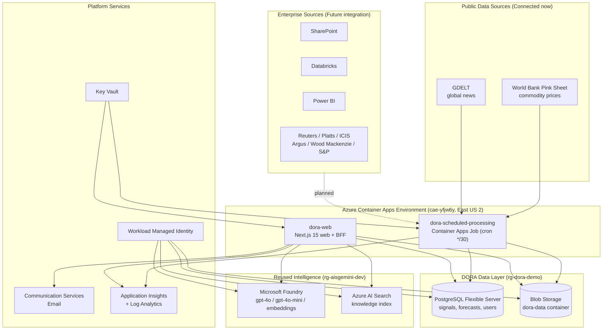

# Current Azure Architecture (Phase 1)

This document describes the **actual deployed** DORA architecture. Where a capability exists in code but is not fully activated, it is labelled explicitly.

## Deployment Summary

- **Region (compute):** East US 2 (`cae-yfjw6y` Container Apps Environment, no VNet).
- **DORA resource group:** `rg-dora-demo` — DORA-owned resources.
- **Reused resource group:** `rg-aisgemini-dev` — shared environment, registry, Foundry, AI Search, and observability.
- **Web endpoint:** `https://dora-web.nicefield-0eb02a6f.eastus2.azurecontainerapps.io`

DORA reuses several existing platform resources (Container Apps Environment, Azure Container Registry, Microsoft Foundry, Azure AI Search, Log Analytics, Application Insights) to keep the prototype lean, and provisions its own data, identity, secret and messaging resources.

## Architecture Diagram

## Component Responsibilities

| Component | Role | Status |
|---|---|---|
| `dora-web` (Container App) | Next.js dashboard + BFF API + database login | Connected now |
| `dora-scheduled-processing` (Container Apps Job) | Cron ingestion, normalisation, forecasting, persistence | Connected now |
| PostgreSQL Flexible Server | Canonical signals, forecasts, risks, users | Connected now |
| Blob Storage (`dora-data` container) | Raw payload and artefact persistence | Connected now |
| Microsoft Foundry | Evidence-grounded synthesis and embeddings | Connected (deterministic baseline guaranteed) |
| Azure AI Search | Knowledge document indexing and retrieval | Configured / activates on document ingest |
| Communication Services Email | Weekly brief delivery | Provisioned / delivery pending recipient config |
| Key Vault + Managed Identity | Secret storage and passwordless data access | Connected now |
| Application Insights + Log Analytics | Telemetry, traces, health | Connected now |

## Networking and Identity

- The Container Apps Environment has **no VNet** in this prototype; services connect over public endpoints protected by managed identity and RBAC.
- Data-plane access (PostgreSQL, Blob, Foundry, AI Search) uses the **workload managed identity** (`dora-demo-workload-id`) rather than connection strings where supported.
- PostgreSQL uses **Microsoft Entra authentication**; the workload principal is registered as a database principal.
- Secrets that cannot use managed identity (for example the ACS connection string) are stored as encrypted Container Apps secrets.

## Connected Now vs Future Integration

**Connected now:** World Bank Pink Sheet, GDELT, scheduled pipeline, PostgreSQL, Blob Storage, deterministic forecasting/risk/scenario engines, database authentication, Application Insights, weekly report generation, and all dashboard UI.

**Future integration:** SharePoint, Databricks, Power BI, commercial market-intelligence feeds (Reuters, Platts, ICIS, Argus, Wood Mackenzie, S&P Global), EIA and FRED (adapters present but disabled pending keys), and Microsoft Copilot Studio exposure.

See [azure-resource-inventory.md](azure-resource-inventory.md) and [data-sources.md](data-sources.md) for details.
</content>
