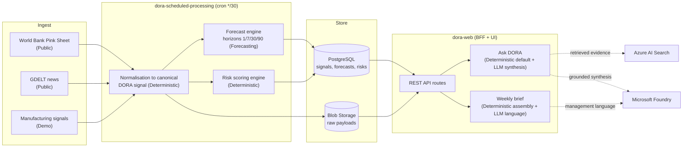

# End-to-End Data Flow (Phase 1)

DORA moves information through five stages: **ingest, normalise, persist, analyse, present**. Each step below is labelled by the type of computation it performs:

- **Deterministic** — fixed rules and math, no model involved.
- **Forecasting** — deterministic statistical projection.
- **LLM** — Microsoft Foundry synthesis over retrieved evidence.
- **Public** — data from public APIs.
- **Demo** — synthetic/seeded data for demonstration.

## Flow Diagram

## Stage Detail

### 1. Ingest (Public + Demo)
- **World Bank Pink Sheet** (Public, LIVE): monthly commodity price series.
- **GDELT** (Public, LIVE): global news events and tone.
- **Manufacturing signals** (Demo): synthetic operational data seeded for demonstration.
- **EIA / FRED** (Public, disabled): adapters present, activated when API keys are supplied.

### 2. Normalise (Deterministic)
Provider payloads are converted into the canonical DORA signal model with source provenance, units, timestamps and quality flags. Commodity dimensions are upserted transactionally before dependent signals to preserve referential integrity.

### 3. Persist (Deterministic)
- **PostgreSQL** stores canonical signals, forecasts, risks and users.
- **Blob Storage** (`dora-data` container) stores raw payloads and generated artefacts.
- Production requires PostgreSQL; local file/SQLite fallback is test-only and never enabled in Azure.

### 4. Analyse
- **Forecasting** (deterministic): baseline projections across horizons 1, 7, 30 and 90 days with uncertainty bands.
- **Risk scoring** (deterministic): rules-based scoring across domains.
- **Scenario engine** (deterministic): what-if projections.
- **AI synthesis** (LLM): Microsoft Foundry explains *why* an evidence set implies a conclusion. Retrieval uses Azure AI Search; the deterministic result is always the guaranteed baseline, and AI adds grounded explanation on top.

### 5. Present
- **Dashboard** and domain pages render deterministic analytics.
- **Ask DORA** answers questions; it runs the deterministic path by default and layers Foundry synthesis over retrieved evidence when configured.
- **Weekly brief** assembles deterministic findings and uses the LLM for management-ready language; delivery via Azure Communication Services Email.

## Guarantees

- Every number a user sees originates from a **deterministic** engine.
- LLM output is always **grounded in retrieved evidence**, never model memory.
- Demo/synthetic data is clearly separated from public live data (see [data-sources.md](data-sources.md)).
</content>
