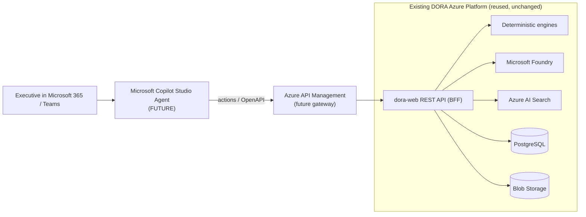

# Microsoft Copilot Studio Evolution

> **Status: FUTURE / Architecture-Ready.** DORA does **not** currently include a Microsoft Copilot Studio agent or application. This document describes how the existing Azure-based DORA platform can later be exposed through Copilot Studio **without rebuilding the Azure backend**.

## Principle: Reuse, Don't Rebuild

DORA's intelligence already lives behind a clean REST API (BFF routes in `apps/web`, documented in [../../openapi/dora-api.yaml](../../openapi/dora-api.yaml)). Copilot Studio does not need its own data layer, forecasting or models — it should call DORA's existing capabilities as **tools/actions**.

## How the Exposure Works

1. **Contract-first:** publish the DORA API via [../../openapi/dora-api.yaml](../../openapi/dora-api.yaml).
2. **Gateway:** front the API with Azure API Management for authentication, rate limiting, token/cost governance and observability (see [target-architecture.md](target-architecture.md)).
3. **Actions:** import the OpenAPI into Copilot Studio as a custom connector / actions so the agent can call DORA read endpoints (forecasts, risks, scenarios, sources, timeline, Ask DORA).
4. **Grounding:** Copilot Studio delegates reasoning to DORA — the deterministic numbers and Foundry-grounded explanations remain authoritative. Copilot Studio orchestrates the conversation; DORA remains the system of record.
5. **Identity:** use Microsoft Entra ID for user identity and on-behalf-of access, aligning with DORA's production auth boundary.

## What Stays the Same

- PostgreSQL, Blob Storage, deterministic engines, Microsoft Foundry, Azure AI Search, Application Insights — **unchanged**.
- The five intelligence domains and the canonical signal model — **unchanged**.
- Provider connectors — **unchanged** (new sources arrive via Phase 2, independent of Copilot Studio).

## What Is Added (future)

- A Copilot Studio agent definition.
- An Azure API Management gateway in front of the DORA API.
- Production Microsoft Entra authentication for the API surface.
- Action/tool mappings from OpenAPI operations to Copilot Studio topics.

## Why This Is Low-Risk

- The API already exists and is documented.
- No data migration is required.
- Deterministic guarantees and evidence grounding carry over unchanged.
- Copilot Studio becomes an additional **surface**, not a replacement backend.

See [migration-checklist.md](migration-checklist.md) for the concrete preparation steps and [target-architecture.md](target-architecture.md) for the target topology.
</content>
