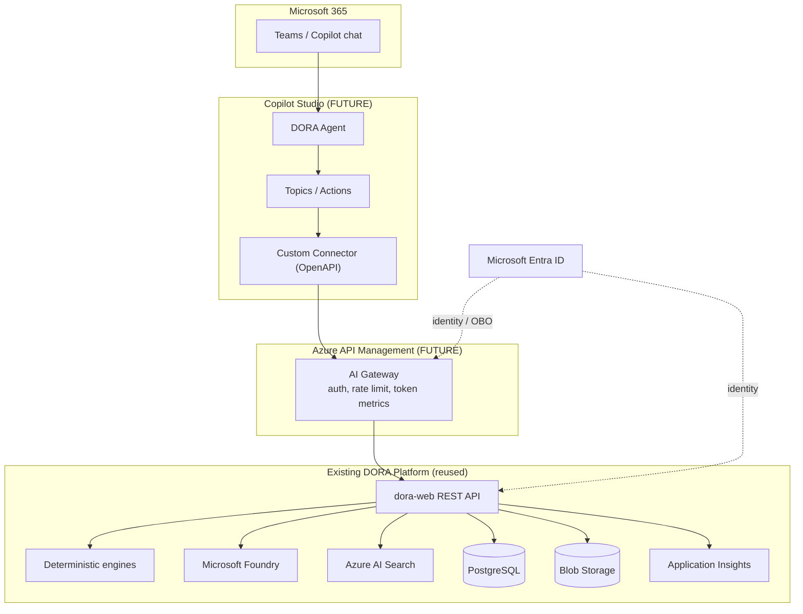

# Copilot Studio Target Architecture

> **Status: FUTURE.** Target topology for exposing DORA through Microsoft Copilot Studio. Nothing here is deployed today.

## Target Topology

## Layer Responsibilities

| Layer | Responsibility | New / Reused |
|---|---|---|
| Copilot Studio agent | Conversation, topics, action orchestration | New (future) |
| Custom connector | Maps OpenAPI operations to actions | New (future) |
| Azure API Management | AuthN/Z, rate/token limits, cost governance, telemetry | New (future) |
| dora-web REST API | Existing DORA capabilities | Reused |
| Deterministic engines | Forecasting, risk, scenarios | Reused |
| Microsoft Foundry | Grounded synthesis | Reused |
| Azure AI Search | Evidence retrieval | Reused |
| PostgreSQL / Blob | System of record | Reused |
| Microsoft Entra ID | Identity + on-behalf-of | Reused/expanded |
| Application Insights | Observability | Reused |

## Recommended API Management Policies (future)

Aligns with the AI gateway pattern:

- `validate-jwt` for Microsoft Entra tokens.
- Token-limit and emit-token-metric for cost governance.
- Rate limiting per caller.
- Backend routing to `dora-web` using managed identity.
- Optional semantic caching only if a resolvable embeddings backend is wired.

## Security Alignment

- Restore `AUTH_PROVIDER=entra` for the production API boundary.
- Use managed identity for APIM-to-backend calls.
- Keep all secrets in Key Vault; no credentials in Copilot Studio or the connector.

## Data Residency and Governance

- No new system of record — DORA's PostgreSQL/Blob remain authoritative.
- Add multi-region and private networking per the Phase 2/3 roadmap.

See [migration-checklist.md](migration-checklist.md) for the ordered steps.
</content>
