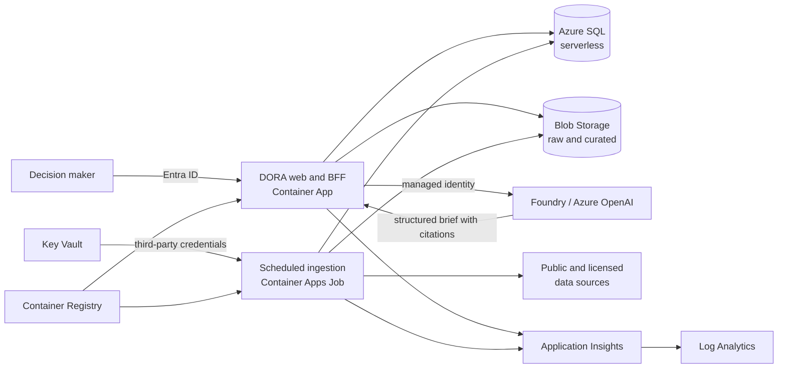
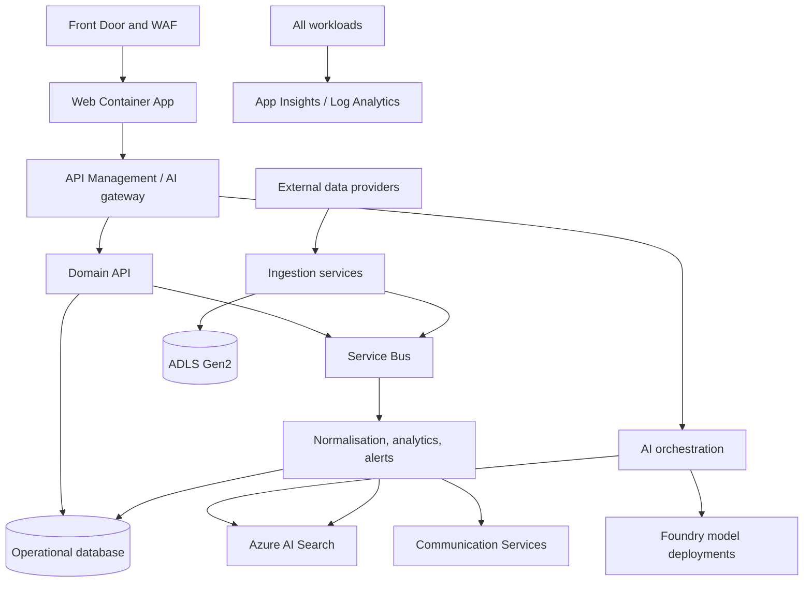

# DORA Current-State Assessment

**Assessment date:** 2026-08-17  
**Phase:** 0 - Analysis before coding  
**Status:** Architecture documented; implementation intentionally not started

## Executive Summary

DORA currently has no application code, repository history, infrastructure-as-code, or local configuration. The workspace is an empty folder and is not a Git repository.

The signed-in Azure Extensions identity can access the Microsoft tenant. The selected/default subscription is `1ES-MCP` (`076b00c5-69cb-4fbf-927c-e3473de84ab5`). Azure Resource Graph returned zero resources of any type in that subscription. A second search across the selected accessible subscriptions found no resource whose name, resource group, or tags contain `dora` or `commodity`.

No existing Azure resource can therefore be recommended for reuse with sufficient evidence. Resources in unrelated corporate subscriptions must not be reused merely because they are visible. Before implementation, the product owner must confirm that `1ES-MCP` is the intended deployment subscription or select another explicitly authorised subscription and resource group.

The recommended MVP is a modular monolith deployed to Azure Container Apps Consumption, supported by one scheduled Container Apps Job, Blob Storage, Azure SQL Database serverless, Azure OpenAI through a Microsoft Foundry project, Key Vault, Application Insights, Log Analytics, and a Basic Azure Container Registry. Azure AI Search, API Management, Azure Communication Services, event streaming, and microservices are deferred until demonstrated demand justifies their fixed cost and operational complexity.

## Assessment Scope and Evidence

### Local workspace

| Check | Result |
|---|---|
| Workspace path | `DoraAI` |
| Visible and hidden contents | Empty |
| Git repository | No `.git` directory; Git reports that the folder is not a repository |
| Application source | None |
| Project manifests | None |
| Infrastructure-as-code | None |
| CI/CD | None |
| Tests | None |
| Documentation | None before this assessment |

### Azure scope

Azure was inspected read-only through the VS Code Azure Extensions authentication context. That context is separate from Azure CLI authentication.

| Item | Result |
|---|---|
| Signed-in account | `mkhalib@microsoft.com` |
| Tenant | Microsoft (`72f988bf-86f1-41af-91ab-2d7cd011db47`) |
| Default subscription | `1ES-MCP` |
| Default subscription ID | `076b00c5-69cb-4fbf-927c-e3473de84ab5` |
| Total resources in default subscription | 0 |
| DORA/commodity-named or tagged resources across selected subscriptions | 0 |

The account can see many selected corporate subscriptions. They were not treated as a pool of reusable assets because visibility does not establish ownership, data classification suitability, quota availability, lifecycle alignment, or permission to attach a new workload.

## Existing Components

There are no existing DORA components to preserve or integrate:

- No frontend, API, data pipeline, AI orchestration, or database schema.
- No authentication or authorisation implementation.
- No domain model, API contract, design system, telemetry, tests, or deployment pipeline.
- No DORA-specific Azure resources discovered.
- No existing Git remote, branches, commits, or repository conventions.

This is a greenfield MVP. The absence of legacy constraints is useful, but basic engineering foundations must be created before feature delivery.

## Reusable Azure Resources

### Confirmed reusable resources

None in the inspected default subscription.

| Priority resource type | Discovery result | Reuse decision |
|---|---|---|
| Microsoft Foundry project/resource | Not found | Create only after subscription confirmation |
| Azure OpenAI/Foundry model deployment | Not found | Create or connect to an explicitly authorised shared deployment |
| Azure Container Apps environment | Not found | Create Consumption environment for MVP |
| Azure Container Registry | Not found | Create Basic registry, unless an authorised shared registry is identified |
| Storage Account | Not found | Create StorageV2 account with Blob/ADLS Gen2 capability |
| Azure AI Search | Not found | Defer initially |
| Key Vault | Not found | Create low-cost vault |
| Application Insights | Not found | Create workspace-based component |
| Log Analytics Workspace | Not found | Create with short retention and daily cap |
| PostgreSQL / Azure SQL / Cosmos DB | Not found | Prefer Azure SQL Database serverless for MVP |
| Azure Communication Services | Not found | Defer until outbound alerts are in scope |
| API Management | Not found | Defer; use Container Apps ingress for MVP |

### Reuse gate before provisioning

Before Phase 1, repeat the resource inventory after confirming the intended subscription. A resource is reusable only if all of the following are true:

- The DORA team has explicit owner approval and suitable RBAC.
- Region, network, data residency, and security policies match DORA.
- Capacity, model quota, and service limits are sufficient.
- Its lifecycle is compatible with the MVP and it will not be removed by another team.
- Cost attribution can be separated with tags or a dedicated resource group.
- Sharing does not create unacceptable blast radius or expose unrelated data.

## Missing Components

### Product and UX

- Defined MVP personas, commodities, geographies, decisions, and success metrics.
- A decision cockpit covering market overview, commodity detail, watchlists, scenarios, and AI briefs.
- Responsive design system, accessibility baseline, empty/loading/error states, and data-freshness language.
- A citation and confidence interaction model for AI-generated insights.

### Application

- Web application and backend-for-frontend API.
- Entra ID authentication and application roles.
- Domain model for commodities, observations, sources, forecasts, scenarios, alerts, and briefs.
- Deterministic analytics service for changes, volatility, trend, spreads, and scenario calculations.
- AI orchestration with structured output, grounding, citations, evaluation, and safety controls.
- Background ingestion, validation, normalisation, retry, and lineage handling.

### Platform

- Confirmed Azure subscription and deployment region.
- Resource group, managed identities, registry, hosting, data, secrets, and observability resources.
- Infrastructure-as-code and environment configuration.
- CI/CD, tests, security checks, budget alerts, and operational runbooks.

## Proposed MVP Architecture

### Architectural principles

1. Build a modular monolith first. Keep domain modules and interfaces explicit, but avoid microservices until independent scaling or ownership requires them.
2. Use code for calculations and the model for explanation. AI must not be the source of truth for prices, KPIs, or arithmetic.
3. Preserve source lineage. Every market observation and generated claim must be traceable to a source, timestamp, and transformation version.
4. Use managed identity between Azure services. Store only third-party credentials in Key Vault.
5. Keep optional fixed-cost services out of the first deployment.
6. Keep the web/API contract stable so services can be separated later without redesigning the UX.

### Recommended technology baseline

| Layer | MVP choice | Rationale |
|---|---|---|
| Web and BFF | Next.js with TypeScript | Fast delivery, polished React UX, server rendering, and one deployable application |
| UI | Purpose-built accessible component system and charting library | Supports a restrained, high-information decision interface without a generic dashboard appearance |
| Hosting | Azure Container Apps Consumption | Scale-to-zero economics, managed ingress, revisions, and a path to separate services |
| Ingestion | Scheduled Azure Container Apps Job | Reuses the container platform and avoids a separate orchestration service |
| Operational data | Azure SQL Database serverless | Relational integrity, time-series queries, familiar tooling, and idle auto-pause |
| Raw/curated data | Blob Storage with hierarchical namespace enabled | Low-cost immutable source snapshots and Parquet/CSV retention |
| AI | Microsoft Foundry project plus a small capable Azure OpenAI model deployment | Managed model lifecycle and structured, grounded decision briefs |
| Secrets | Azure Key Vault | Central secret storage and managed-identity access |
| Images | Azure Container Registry Basic | Lowest practical managed registry tier |
| Observability | Application Insights plus Log Analytics | Request, dependency, exception, job, and model telemetry |
| Identity | Microsoft Entra ID, single tenant | Enterprise-ready authentication without building identity flows |
| IaC and delivery | Bicep plus GitHub Actions with OIDC | Repeatable environments and secretless deployment authentication |

### Logical flow

### Initial product slice

The first convincing vertical slice should support three to five commodities rather than a broad but shallow catalogue:

- Executive market overview with latest price, change, volatility, freshness, and source status.
- Commodity detail with historical series, drivers, related macro indicators, and source lineage.
- Watchlist and threshold-based decision signals.
- Scenario comparison using deterministic calculations and explicit user assumptions.
- AI-generated daily brief grounded only in retrieved DORA data, with citations and confidence labels.
- Export of a decision brief to PDF or a shareable print view.
- Admin data-health view for failed feeds, stale series, and quality checks.

### Real-data strategy

Start with reputable public sources and cache source snapshots in Blob Storage:

| Data need | Practical MVP candidates | Notes |
|---|---|---|
| Broad commodity benchmarks | World Bank Commodity Price Data (Pink Sheet), IMF commodity datasets | Good historical baseline; usually monthly rather than trading-grade real time |
| Energy | U.S. Energy Information Administration Open Data | Useful oil, gas, power, inventory, and production series; API key may be required |
| Agriculture | USDA public datasets/APIs | Strong supply, demand, production, and trade context; source-specific normalisation required |
| Macro drivers | FRED and World Bank indicators | Rates, FX proxies, inflation, and industrial indicators |
| Weather context | NOAA public APIs/datasets | Add only for commodities where weather materially improves the decision story |
| Live futures and exchange data | Licensed provider, deferred | Public data is not a substitute for exchange-licensed real-time settlement and futures data |

Each connector should implement a common ingestion contract: source identifier, retrieval timestamp, observation timestamp, unit, currency, geography, frequency, revision status, licence metadata, checksum, and quality status.

### UX direction

Apple-inspired should mean clarity and restraint, not visual imitation:

- Prioritise one decision question per view and use progressive disclosure for detail.
- Use generous spacing around dense, precise data rather than filling the screen with cards.
- Use neutral surfaces with semantic colour reserved for change, confidence, and risk.
- Make data freshness, units, source, and confidence continuously visible.
- Prefer direct manipulation for scenario inputs with immediate chart and KPI updates.
- Use smooth, purposeful transitions while respecting reduced-motion settings.
- Meet WCAG 2.2 AA for contrast, keyboard use, focus, semantics, and screen-reader output.
- Design desktop-first for analysis while keeping watchlists and briefs effective on mobile.

## Production Evolution Architecture

Evolve by replacing specific boundaries, not by rewriting the application:

1. Separate the Next.js frontend, domain API, ingestion workers, and AI orchestration into independently deployed Container Apps when load or team ownership warrants it.
2. Introduce Service Bus between ingestion, normalisation, analytics, alerting, and brief generation for durable retries and back-pressure.
3. Promote Blob Storage to an ADLS Gen2 bronze/silver/gold layout and add Microsoft Fabric, Azure Databricks, or Azure Data Factory only when data volume and transformation complexity justify them.
4. Move Azure SQL from serverless MVP sizing to provisioned or elastic capacity; add read replicas, partitioning, or a specialised analytical store based on measured workloads.
5. Add Azure AI Search for hybrid/vector retrieval over licensed research, reports, news, and DORA-generated documents.
6. Put APIs and model endpoints behind API Management when external consumers, policy enforcement, semantic caching, quotas, or chargeback are required.
7. Add Azure Communication Services for email/SMS alerts and Event Grid for event fan-out when notification workflows mature.
8. Add Azure Front Door with WAF, private endpoints, workload identities, customer-managed keys where required, and environment isolation for production security.
9. Add multi-region recovery, geo-replicated data, tested failover, and formal SLOs only after business impact and recovery objectives are defined.
10. Preserve OpenTelemetry traces, model/prompt versions, evaluation datasets, and user feedback to support AI quality governance.

## Estimated Prototype Complexity

**Overall:** Medium. The Azure hosting is straightforward; data normalisation, traceable analytics, and trustworthy AI explanations are the dominant risks.

| Workstream | Complexity | Indicative effort |
|---|---|---|
| Product definition and UX prototype | Medium | 1-2 engineer/designer weeks |
| Web/BFF foundation and Entra ID | Medium | 1-2 engineer weeks |
| Three to five source connectors and canonical model | Medium-High | 2-3 data-engineer weeks |
| Decision cockpit and visualisations | Medium-High | 2-3 frontend-engineer weeks |
| Deterministic analytics and scenarios | Medium | 1-2 engineer weeks |
| Grounded AI brief and evaluation | Medium-High | 1-2 AI-engineer weeks |
| Azure IaC, CI/CD, telemetry, and security baseline | Medium | 1-2 cloud-engineer weeks |
| Integrated testing and demo hardening | Medium | 1-2 team weeks |

With two experienced full-stack/data engineers and part-time product/design input, a focused vertical-slice MVP is plausibly a four-to-six-week effort. A solo implementation is more likely eight-to-twelve weeks. These are planning ranges, not commitments; commodity scope, data licensing, and identity requirements can materially change them.

## Cost Optimisation Recommendations

- Confirm the target subscription and establish a small tagged resource group before provisioning.
- Use Container Apps Consumption with minimum replicas set to zero for web preview environments and background workers.
- Keep one web/BFF deployment and one scheduled job instead of multiple always-on services.
- Use Azure SQL serverless with auto-pause and conservative maximum vCores; review cold-start tolerance during demos.
- Use Blob lifecycle rules to move old raw snapshots to cool storage and retain only required versions.
- Start with ACR Basic and one region.
- Set Log Analytics retention to the minimum useful period, add a daily ingestion cap, and exclude noisy telemetry.
- Use a small model for routine extraction and summaries; reserve larger models for explicit high-value analysis.
- Cap model tokens, cache briefs by data/version hash, batch offline generation, and record token usage per feature.
- Do not provision Azure AI Search, API Management, Communication Services, private networking, or multi-region infrastructure in the first cut unless a validated requirement appears.
- Configure Azure budgets and alerts before the first deployment; tag resources with `application=DORA`, `environment`, `owner`, `cost-center`, and `expires-on`.
- Tear down ephemeral environments automatically and prohibit untagged resources through CI policy checks.

A reasonable design target is an idle platform baseline below roughly USD 100/month and an actively demonstrated prototype below roughly USD 300/month, excluding premium market-data licences and highly variable model usage. This is directional only; current regional prices, internal Azure agreements, model choice, and actual traffic must be validated with the Azure Pricing Calculator before approval.

## Assumptions

- `1ES-MCP` is the provisional target because it is the current default subscription; this is not yet confirmed.
- DORA is an internal, single-tenant application for the MVP.
- The first release serves tens of users, not thousands, and can tolerate scale-from-zero latency.
- Three to five commodities and daily or monthly public data are enough to demonstrate value.
- Real-time exchange data and redistribution rights are not required for the first prototype.
- AI output is advisory, cites DORA-controlled evidence, and is not an autonomous trading recommendation.
- The team can use GitHub, GitHub Actions OIDC, Microsoft Entra ID, and managed identities.
- One Azure region is sufficient until data residency, latency, and recovery objectives are defined.
- Public endpoints are acceptable for the prototype when protected by Entra ID and least-privilege access.

## Technical Risks and Mitigations

| Risk | Impact | Mitigation |
|---|---|---|
| Wrong or unauthorised Azure subscription | Cost, policy, and ownership conflict | Require explicit subscription/resource-group approval before Phase 1 |
| No existing code or delivery baseline | More setup before visible features | Create a thin vertical slice and deployment pipeline first |
| Public data is delayed, revised, or inconsistent | Misleading analysis | Store snapshots, revision flags, quality checks, units, and lineage |
| Market-data licensing restrictions | Prototype cannot become commercial unchanged | Record licence metadata now; isolate provider adapters; obtain legal review before redistribution |
| Commodity symbols, units, currencies, and calendars differ | Incorrect comparisons | Define a canonical data contract and tested conversion rules |
| Model hallucination or unsupported claims | Loss of user trust | Retrieval-only grounding, structured output, citations, deterministic KPIs, abstention, and evaluation sets |
| Prompt injection in external documents | Data leakage or manipulated briefs | Treat retrieved text as untrusted, restrict tools, filter content, and enforce output schemas |
| Scale-to-zero and SQL auto-pause cold starts | Poor first-demo experience | Use a warm-up request for scheduled demos; measure before raising minimum capacity |
| Model quota or regional availability | Blocked deployment or unstable throughput | Check quota and deployment availability before selecting region/model |
| Excess telemetry or model usage | Unexpected prototype spend | Daily caps, budgets, sampling, token limits, caching, and per-feature cost telemetry |
| Premature microservices or analytics platform | Delivery delay and operational burden | Enforce modular-monolith and scheduled-job scope for MVP |
| AI Search omitted initially | Limited document RAG | Keep a retrieval interface so Search can be added without changing callers |
| Accessibility treated as polish | Rework and exclusion | Include WCAG 2.2 AA checks in component acceptance criteria from the start |

## Required Decisions Before Phase 1

1. Confirm the deployment subscription, resource group ownership, and permitted region.
2. Confirm the first three to five commodities, target personas, and decisions DORA must improve.
3. Confirm acceptable data latency and whether any licensed feed is already available.
4. Confirm the approved Foundry/Azure OpenAI model and quota, or authorise a new deployment.
5. Confirm single-tenant Entra ID access and the initial user/application roles.
6. Approve the proposed modular-monolith MVP boundary and deferred services.

## Phase 0 Exit Decision

Phase 0 is complete. The architecture is documented, but implementation must remain stopped until the target Azure subscription and the required product/data decisions above are confirmed.
