# DORA Intelligence Engine

## Pipeline

```mermaid
flowchart LR
  C[Collect] --> V[Validate]
  V --> N[Normalize]
  N --> F[Score freshness]
  F --> A[Detect anomalies]
  A --> T[Calculate trend]
  T --> R[Detect correlation]
  R --> D[Potential causal drivers]
  D --> K[Supporting research]
  K --> H[Hypotheses]
  H --> M[Forecast context]
  M --> I[Management insight]
```

`DoraIntelligenceEngine` accepts canonical `DoraSignal` records and an `asOf` cutoff. Future-dated signals are excluded, every retained signal is validated with the canonical schema, duplicate signal IDs are collapsed, and records are time ordered before analysis.

## Evidence Classes

Every output carries one immutable classification:

- `FACT`: validated source signals and retrieved source passages.
- `CALCULATION`: freshness decay, z-scores, OLS trends, Pearson correlations, temporal-driver screening, and deterministic fallback language.
- `MODEL_FORECAST`: output from the injected deterministic, statistical, or ML forecast engine.
- `AI_INTERPRETATION`: hypotheses, explanations, scenarios, summaries, and recommendations returned by an explicitly configured interpreter.

The interpreter receives facts, calculations, model forecasts, and retrieved research as evidence. It cannot replace forecast engine output or relabel calculations. Without an interpreter, the pipeline still completes using conservative deterministic hypotheses and management rules.

## Methods

- Freshness uses exponential age decay against each signal's expected refresh cadence.
- Anomalies use within-series population z-scores and require sufficient observations.
- Trend uses ordinary least-squares slope on time-ordered numeric observations.
- Correlation uses Pearson correlation only for timestamp-aligned numeric series with at least three shared observations.
- Potential causal drivers require commodity alignment, temporal precedence, and minimum relevance. They are always labeled hypotheses because temporal precedence and correlation do not prove causation.
- Forecasts are generated only for sufficiently populated price series by the injected `ForecastEngine`. The current baseline is the deterministic drift engine with residual uncertainty intervals.
- Supporting research is retrieved through the DORA knowledge layer and filtered to the requested `asOf` date.

## LLM Role

An approved Foundry implementation may be connected through `IntelligenceInterpreter` for reasoning, synthesis, explanation, scenario interpretation, executive summaries, hypothesis generation, and recommendations. Its instruction boundary explicitly forbids calculating, altering, or inventing numeric forecasts and requires cautious causal language and citations.

The engine remains functional when no model deployment is configured.
