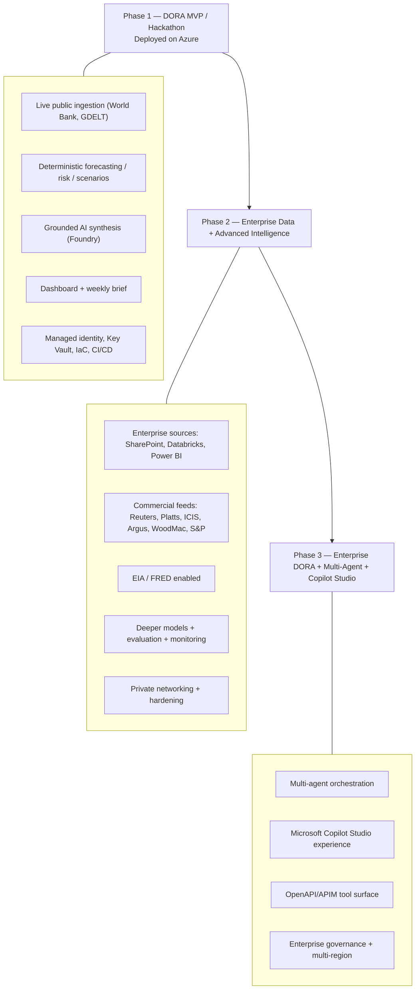

# DORA Roadmap

DORA evolves in three phases. Phase 1 is deployed today; Phases 2 and 3 build on the same Azure backend without rebuilding it.

## Phase Flow

## Phase 1 — DORA MVP / Hackathon (DELIVERED)

The current repository. Deployed and running on Azure.

- Live ingestion of public commodity prices (World Bank Pink Sheet) and news (GDELT) via a scheduled Container Apps Job.
- Canonical signal model with provenance.
- Deterministic forecasting (horizons 1/7/30/90 with uncertainty), risk scoring and scenarios.
- Microsoft Foundry synthesis grounded in retrieved evidence (Azure AI Search).
- PostgreSQL + Blob persistence, database authentication, weekly report generation.
- Managed identity, Key Vault, Bicep IaC, GitHub Actions CI/CD, Application Insights.

## Phase 2 — Enterprise Data + Advanced Intelligence (PLANNED)

Grow signal quality and intelligence depth on the same backend.

- **Enterprise connectors:** SharePoint, Databricks, Power BI.
- **Commercial feeds:** Reuters, Platts, ICIS, Argus, Wood Mackenzie, S&P Global (licensed).
- **Public expansion:** enable EIA and FRED.
- **Advanced intelligence:** richer models, evaluation harness, continuous quality monitoring.
- **Hardening:** private networking, private endpoints, production Microsoft Entra authentication, multi-region readiness.

## Phase 3 — Enterprise DORA + Multi-Agent + Copilot Studio (FUTURE)

Bring DORA to where executives already work, with agentic orchestration.

- **Multi-agent orchestration** over the existing intelligence services.
- **Microsoft Copilot Studio** experience exposing DORA as tools/actions.
- **API/APIM tool surface** from the existing OpenAPI contract.
- **Enterprise governance:** compliance, auditing, multi-region resilience.

## Phase Comparison

| Dimension | Phase 1 (now) | Phase 2 | Phase 3 |
|---|---|---|---|
| Data sources | Public (World Bank, GDELT) + demo | + Enterprise + commercial + EIA/FRED | Full enterprise breadth |
| Intelligence | Deterministic + grounded AI | + advanced models + evaluation | + multi-agent orchestration |
| Access surface | Web app | Web app | Web app + Copilot Studio |
| Auth | Database (prototype) | Microsoft Entra (production) | Enterprise Entra + governance |
| Networking | No VNet (RBAC) | Private networking | Private + multi-region |
| Status | Deployed | Planned | Future |

## Guiding Principle

Do not rebuild the Azure backend. Each phase adds connectors, intelligence and surfaces on top of the Phase 1 platform.
</content>
